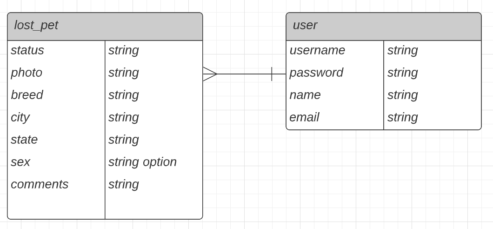

# The Lost & Hound

**Summary**
| Field | Detail |
|-------|--------|
| Project Name | The Lost & Hound |
| Description | A lost and found app for furry (and feathery) family members. Post your lost or found pet, search through listings, generate a lost/found pet flyer and contact a lost pet's owner if their pet has been located. |
| Developers | [Javier](https://github.com/Vanillajaviscript), [Cheryl](https://github.com/chess2022), [Kelly](https://github.com/kellyluuu) |
| Live Website |  |
| Project Planning & Management | [Trello](https://trello.com/b/C0LXFmGi/lost-and-hound) |

## User Stories

List of stories users should experience when using your application.

- As a user, I can create account and login.
- As a user, I can post a lost pet.
- As a user, I can create and download a pdf flyer.
- As a user, I can update my lost pet post.
- As a user, I can contact lost pet owner.
- As a user, I can search for lost pet.
- As a user, I can view all lost pet.
- As a user, I can view detail on a lost pet.

## List of technologies used

- PostgreSQL
- Python
- Django
- AWS

## Idea Prototype
[Prototype](https://xd.adobe.com/view/fbbda07b-678a-4a6c-ad3e-a6c1cc736064-aeee/?fullscreen&hints=off)

## ERD

## Component Architecture

## User Interface Mockups

#### Main Page

#### Lost Pet List 

#### Pet Details

#### Log In & Sign Up

#### Post Lost/Found Pet

#### Post Success Confirmation

